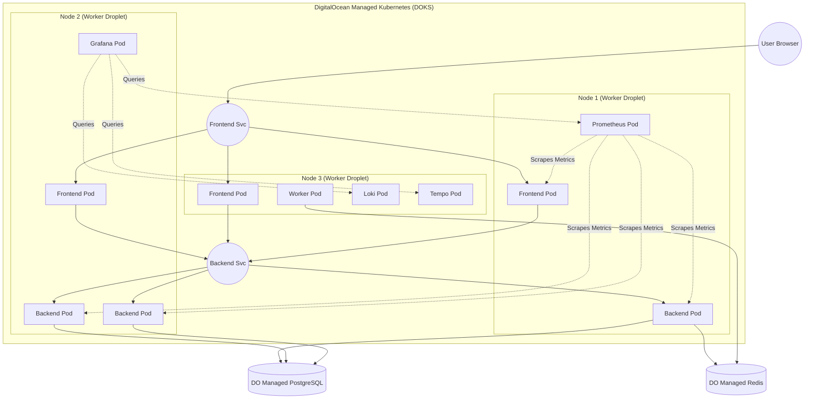

# Kubernetes Architecture & Core Concepts

## 1. What is Kubernetes and why use it over Droplets?

Kubernetes (K8s) is a container orchestration platform. Unlike running containers directly on individual virtual machines (Droplets) via Docker Compose, Kubernetes treats a pool of servers as one giant compute resource. It handles where to place containers, how to scale them, how to restart them if they crash, and how to route traffic to them securely. We use it instead of single Droplets because it provides high availability, auto-scaling, zero-downtime deployments, and self-healing.

## 2. Core Concepts

- **Cluster:** A set of nodes (machines) running containerized applications managed by Kubernetes.
- **Node:** A physical or virtual machine (like a Droplet) that acts as a worker in the cluster.
- **Pod:** The smallest deployable unit in Kubernetes. A Pod contains one or more containers (like our backend or frontend) and shares storage/network.
- **Deployment:** A controller that ensures a specified number of identical Pods (replicas) are running at any given time.
- **Service:** An abstraction that defines a logical set of Pods and a policy to access them (an internal load balancer).
- **Ingress:** An API object that manages external access to the services in a cluster, typically HTTP/HTTPS.
- **ConfigMap:** An object used to store non-confidential configuration data in key-value pairs (like ENV vars).
- **Secret:** Similar to a ConfigMap but used specifically to store sensitive data like passwords, OAuth tokens, and SSH keys.
- **Namespace:** A virtual cluster inside your Kubernetes cluster, used to isolate resources (e.g., `cloudpulse` vs `monitoring`).

## 3. What Does "3 Replicas" Mean?

When you ran `docker compose up`, you typically had exactly one container for the backend. In K8s, a **Deployment** lets us specify `replicas: 3`. 
This means Kubernetes will create **3 distinct, identical Pods**, each running the backend container. It distributes these 3 Pods across your available Worker Nodes. If a Node crashes, Kubernetes automatically restarts the lost Pod on a surviving Node!

## 4. How Services Act as Internal Load Balancers

Because Pods can be destroyed and recreated at any time, their IPs constantly change. We never connect directly to a Pod IP. Instead, a **Service** provides a stable IP and DNS name. For example, our frontend Pod simply makes API requests to `http://backend-service:8000`. The Service automatically load-balances that request to one of the 3 healthy backend Pods.

## 5. Cluster Architecture Diagram

## 6. How K8s differs from Docker Compose

- **No Hardcoded IPs:** In Docker Compose you might map specific host ports or use hardcoded container IPs. K8s uses its internal DNS.
- **Self-Healing:** If a Docker container crashes, unless you set `restart: always`, it might stay dead. K8s will automatically restart it or recreate the Pod.
- **Scaling:** Scaling with compose is harder; K8s makes it as easy as changing `replicas: 1` to `replicas: 3`.

## 7. DOKS and Control Plane

With DigitalOcean Kubernetes (DOKS), DigitalOcean manages the control plane (the brains of Kubernetes: API server, scheduler, controller manager) for free. **We only pay for the worker nodes** (the Droplets that actually run our workloads).
